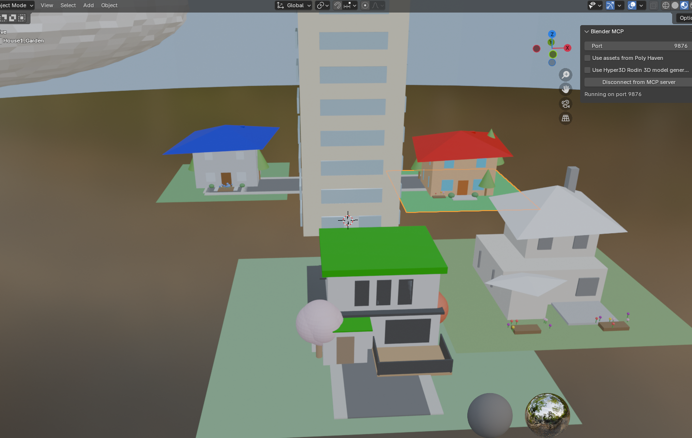
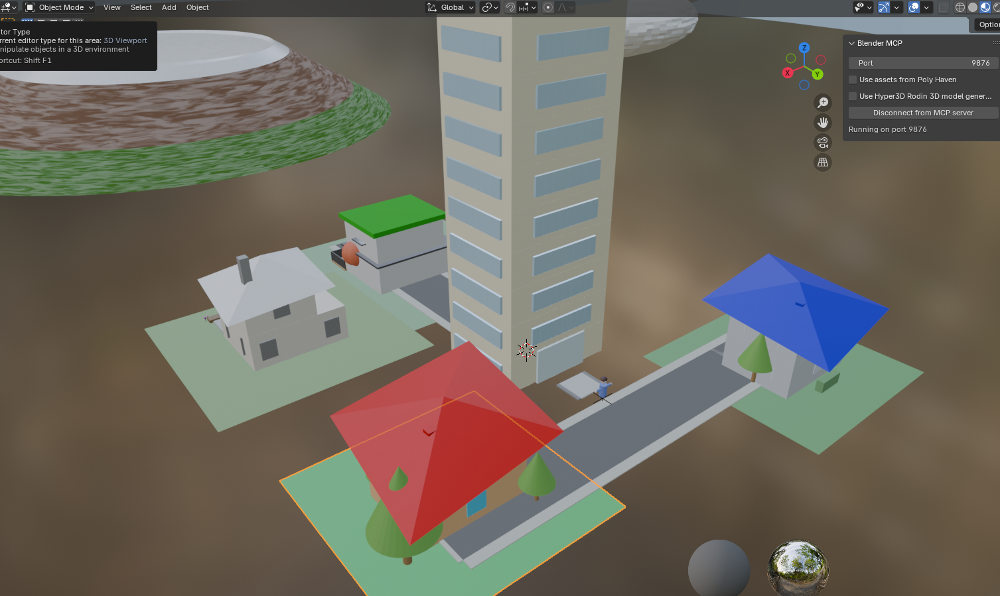
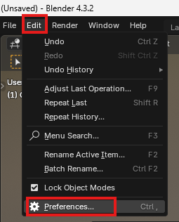
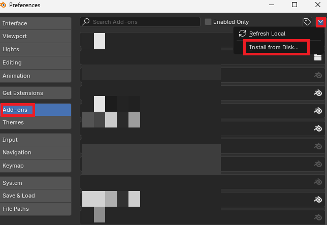
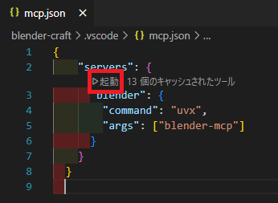
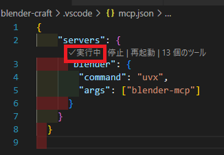
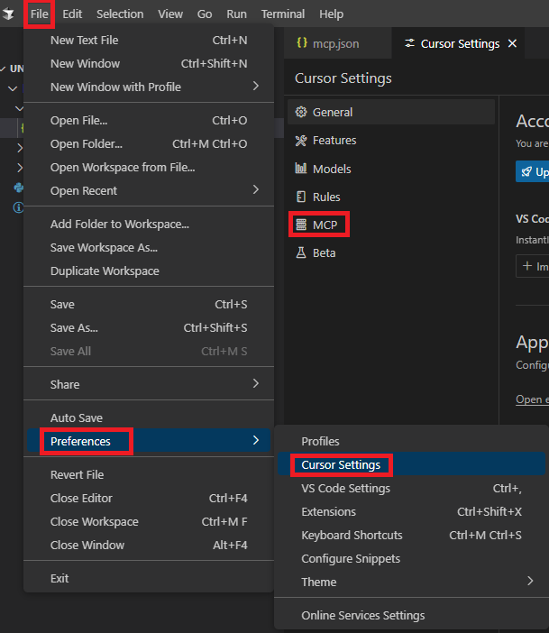
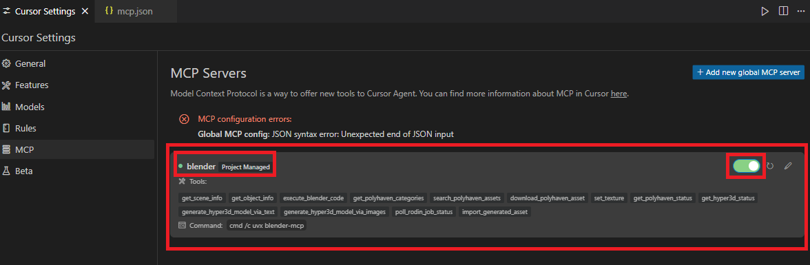

# Blender Craft: VSCodeとBlender MCPを使って自然言語のみで3DCGを作る


*自然言語の指示のみで生成された3Dモデルの例*

## 概要

このリポジトリは、Visual Studio Code (VSCode) とModel Context Protocol (MCP) を連携させ、自然言語の指示だけでBlender上で3Dモデルを生成するためのセットアップ方法と簡単な使用例を紹介します。

PythonとBlenderを組み合わせたワークフローに興味がある方や、MCPで何ができるのか視覚的に試してみたい方に特におすすめです。基本的な設定から最初の3Dモデル作成まで、およそ30分程度で体験できます。

本ドキュメントでは、以下の内容を順を追って説明します。
*   VSCodeからBlenderを操作するためのMCP設定方法
*   簡単な3Dモデルの作成例
*   (オプション) Cursorエディタでの設定方法

このプロジェクトは、[Ahuja/blender-mcp](https://github.com/ahujasid/blender-mcp) リポジトリを参考にしていますが、VSCodeを使用した実装に関する情報が少なかったため、独自に検証し情報をまとめています。

**注意:** このプロジェクトはMCPの利用に焦点を当てており、Blender自体の詳細な操作方法については解説しません。MCPを利用することで、多くの場合Blender本体を直接操作する必要は少なくなります。

### MCP (Model Context Protocol) とは？
Model Context Protocol (MCP) は、AIモデルと各種ソフトウェア間でコードや情報を送受信し、連携を可能にするためのプロトコルです。詳細は[公式ドキュメント](https://modelcontextprotocol.io/introduction)をご参照ください。

## 目次
- [Blender Craft: VSCodeとBlender MCPを使って自然言語のみで3DCGを作る](#blender-craft-vscodeとblender-mcpを使って自然言語のみで3dcgを作る)
  - [概要](#概要)
    - [MCP (Model Context Protocol) とは？](#mcp-model-context-protocol-とは)
  - [目次](#目次)
  - [デモ](#デモ)
  - [必要なもの](#必要なもの)
  - [セットアップ](#セットアップ)
    - [1. Blender側の設定](#1-blender側の設定)
      - [1.1. アドオンのダウンロード](#11-アドオンのダウンロード)
      - [1.2. Blenderへのアドオンインストールと有効化](#12-blenderへのアドオンインストールと有効化)
      - [1.3. 設定の確認](#13-設定の確認)
    - [2. VSCode側の設定](#2-vscode側の設定)
      - [2.1. uv (Pythonパッケージマネージャー) のセットアップ](#21-uv-pythonパッケージマネージャー-のセットアップ)
      - [2.2. VSCodeプロジェクトの作成と設定](#22-vscodeプロジェクトの作成と設定)
    - [3. (おまけ) Cursorを使う場合の設定](#3-おまけ-cursorを使う場合の設定)
  - [使用方法](#使用方法)
    - [1. MCPサーバーの起動](#1-mcpサーバーの起動)
      - [VSCodeの場合](#vscodeの場合)
      - [Cursorの場合](#cursorの場合)
    - [2. Blender側での接続](#2-blender側での接続)
    - [3. AIのエージェントモードを使ってBlenderで3Dモデルを作成](#3-aiのエージェントモードを使ってblenderで3dモデルを作成)
      - [GitHub Copilotの設定例 (VSCode)](#github-copilotの設定例-vscode)
    - [4. Pythonコードの直接実行 (任意)](#4-pythonコードの直接実行-任意)
  - [考察](#考察)
  - [参考資料](#参考資料)
  - [License](#license)

## デモ
以下は、VSCode (またはCursor) から自然言語で指示を送り、MCP経由でBlender上に生成された3Dモデルの例です。Blenderの直接操作は行っていません。

| 作成したサンプル1 | 作成したサンプル2 |
| :---------------------------: | :--------------------: |
|  |  |
|  |  |

## 必要なもの
以下のソフトウェアを事前にインストールしてください。
- [Blender](https://www.blender.org/download/)
- [Visual Studio Code](https://code.visualstudio.com/)
- (オプション) [Cursor](https://www.cursor.com/ja)

## セットアップ

### 1. Blender側の設定
#### 1.1. アドオンのダウンロード
[Ahuja/blender-mcpリポジトリ](https://github.com/ahujasid/blender-mcp)から、[addon.pyファイル](https://github.com/ahujasid/blender-mcp/blob/main/addon.py)をローカルにダウンロードします。

#### 1.2. Blenderへのアドオンインストールと有効化
1.  Blenderを起動します。
2.  **Edit** → **Preferences** → **Add-ons** を選択します。
    
    

3.  **Install...** ボタンをクリックします。(画像では "Install from Disk" となっていますが、バージョンにより文言が若干異なる場合があります)
    

4.  ダウンロードした `addon.py` ファイルを選択し、インストールします。
    

5.  インストール後、アドオンリストで「**BlenderMCP**」を検索し、チェックボックスをオンにして有効化します。

#### 1.3. 設定の確認
1.  Blenderの3Dビューポートで **Nキー** を押してサイドパネルを表示します。
2.  サイドパネルに「**BlenderMCP**」タブが表示されていれば設定成功です。
        
    

### 2. VSCode側の設定
#### 2.1. uv (Pythonパッケージマネージャー) のセットアップ
1.  **uvパッケージマネージャーのインストール**
    *   Windows (PowerShell):
        ```powershell
        powershell -ExecutionPolicy ByPass -c "irm https://astral.sh/uv/install.ps1 | iex"
        ```
    *   macOS / Linux (ターミナル):
        ```bash
        curl -LsSf https://astral.sh/uv/install.sh | sh
        ```
2.  **uvをPATHに追加 (Windowsの場合の例)**
    ターミナルを再起動するか、以下のコマンドを実行してください (ユーザー名 `nntra` はご自身のものに置き換えてください)。
    ```powershell
    # 永続的に追加する場合 (PowerShell)
    $CurrentUserPath = [System.Environment]::GetEnvironmentVariable("Path", "User")
    $UvBinPath = "$($env:USERPROFILE)\.local\bin"
    if (-not ($CurrentUserPath -split ';' -contains $UvBinPath)) {
        [System.Environment]::SetEnvironmentVariable("Path", "$CurrentUserPath;$UvBinPath", "User")
        Write-Host "uv path added. Please restart your terminal."
    } else {
        Write-Host "uv path already exists."
    }
    ```
    *上記コマンドがうまくいかない場合や、一時的にPATHを設定したい場合は `set Path=C:\Users\YOUR_USERNAME\.local\bin;%Path%` をコマンドプロンプトで実行してください。ただしこれは現在のセッションでのみ有効です。*

3.  **uvの確認 (任意)**
    新しいターミナルを開き、`uv --version` 等で動作確認してください。

    また、念のため以下も実行しておくと良いでしょう。
    ```bash
    pip install uv
    ```

#### 2.2. VSCodeプロジェクトの作成と設定
1.  任意の場所に作業フォルダを作成します (例: `blender-craft`)。
2.  VSCodeでこのフォルダをワークスペースとして開きます。
3.  ワークスペースのルートに `.vscode` フォルダを作成し、その中に `mcp.json` ファイルを以下の内容で作成します。

    **.vscode/mcp.json**
    ```json
    {
        "servers": {
          "blender": {
            "command": "uvx",
            "args": ["blender-mcp"]
          }
        }
    }
    ```
    

### 3. (おまけ) Cursorを使う場合の設定
Cursorエディタを使用する場合の設定です。VSCodeを使用する場合はこのセクションは不要です。

1.  任意の場所に作業フォルダを作成します (VSCodeと同じフォルダでも可)。
2.  Cursorでこのフォルダをワークスペースとして開きます。
3.  ワークスペースのルートに `.cursor` フォルダを作成し、その中に `mcp.json` ファイルを以下の内容で作成します。

    **.cursor/mcp.json**
    ```json
    {
        "mcpServers": {
            "blender": {
                "command": "cmd",
                "args": [
                    "/c",
                    "uvx",
                    "blender-mcp"
                ]
            }
        }
    }
    ```
   

## 使用方法

### 1. MCPサーバーの起動

#### VSCodeの場合
1.  VSCodeで `.vscode/mcp.json` ファイルを開きます。
2.  ファイル内に表示される「**起動**」(または "Start") というテキスト(CodeLens)をクリックします。
    
    

3.  表示が「**実行中**」(または "Running") に変わることを確認します。

    

#### Cursorの場合
1.  **File** → **Preferences** → **Settings** を選択し、「Cursor Settings」を開きます。
2.  左側のメニューから **MCP** を選択します。

    

3.  `mcp.json` で設定したサーバー ("blender") がリストに表示されます。右側のスイッチをオンにし、ステータスが接続中のような表示 (緑色のアイコンなど) になればOKです。
    

### 2. Blender側での接続
1.  Blenderの3Dビューポートで **Nキー** を押してサイドパネルを表示します。
2.  「**BlenderMCP**」タブをクリックします。
3.  「**Connect to MCP server**」ボタンをクリックします。
    
    

4.  ボタンの表示が「**Disconnect from MCP server**」に変われば接続成功です。
    

### 3. AIのエージェントモードを使ってBlenderで3Dモデルを作成
VSCode (またはCursor) とBlenderの接続が成功したら、AIチャット機能のエージェントモード (例: GitHub Copilot Chat の `@workspace` やエディタ機能、CursorのAI機能) を活用して、自然言語で指示を出すことでBlender上にオブジェクトを生成できます。

#### GitHub Copilotの設定例 (VSCode)
VSCodeでGitHub Copilot Chatを使用する場合、チャットウィンドウで `@blender` (またはmcp.jsonで設定したサーバー名) をメンションするか、エージェントがMCPサーバーを認識できるような設定を行います。
(MCP連携が確立されていれば、CopilotがBlenderのコンテキストを理解しやすくなります。)


AIがユーザーの指示をPythonコード (Blender Python API) に変換し、MCPを通じてBlenderに送信することで3Dモデルが生成されます。

### 4. Pythonコードの直接実行 (任意)
AIチャットを通さず、直接Pythonスクリプトを書いてBlenderで実行することも可能です。これは、特定の操作を自動化したい場合や、AIの生成したコードを修正・拡張したい場合に便利です。

1.  VSCode (またはCursor) で新しいPythonファイル (例: `create_cube.py`) を作成します。
2.  以下のサンプルコードを入力します。

    ```python
    import bpy

    # 既存のオブジェクトをクリア（任意）
    if bpy.context.mode == 'OBJECT':
        bpy.ops.object.select_all(action='SELECT')
        bpy.ops.object.delete()
    elif bpy.context.mode == 'EDIT':
        bpy.ops.object.mode_set(mode='OBJECT')
        bpy.ops.object.select_all(action='SELECT')
        bpy.ops.object.delete()


    # キューブを作成
    bpy.ops.mesh.primitive_cube_add(size=2, location=(0, 0, 1))
    cube = bpy.context.active_object
    if cube: # オブジェクトが選択されているか確認
        cube.name = "MyCube"

        # マテリアルを作成して適用
        mat = bpy.data.materials.new(name="BlueMaterial")
        mat.use_nodes = True
        principled = mat.node_tree.nodes.get('Principled BSDF')
        if principled:
            principled.inputs['Base Color'].default_value = (0.0, 0.3, 0.8, 1.0)  # 青色 (RGBA)

        # マテリアルをオブジェクトに適用
        if len(cube.data.materials) == 0:
            cube.data.materials.append(mat)
        else:
            cube.data.materials[0] = mat

    # ビューポートの表示モードをマテリアルプレビューに変更
    for area in bpy.context.screen.areas:
        if area.type == 'VIEW_3D':
            for space in area.spaces:
                if space.type == 'VIEW_3D':
                    space.shading.type = 'MATERIAL'
                    break
            break

    print("青いキューブを作成しました！")
    ```

3.  スクリプトの実行方法
    *   ファイル全体を選択し、`Shift + Enter` (または設定による実行キー) を押す。
    *   コードの一部を選択して `Shift + Enter` を押す。
    *   エディタの右クリックメニューから「MCP: Run Selection」や「MCP: Run File」などのMCP関連の実行コマンドを選択する (エディタや拡張機能により異なります)。

**重要**
通常のターミナルから `python your_script.py` のように実行しようとすると、`ModuleNotFoundError: No module named 'bpy'` というエラーが発生します。BlenderのPython API (`bpy`) はBlender環境内でのみ利用可能なため、必ずMCPを経由してエディタから実行してください。

## 考察
VSCode (Cursorも可) とBlenderをMCPサーバー経由で連携させることで、Blender本体をほぼ操作することなく、自然言語やPythonスクリプトから3Dモデルを生成することができました。

**所感**
*   **指示の具体性:** 「家を作って」のような抽象的な指示では、シンプルな板の組み合わせのような結果になりがちでした。より具体的な指示 (例: 「ベージュの壁、赤茶色の三角屋根を持つ8m×6mの2階建ての家。前面にポーチ、周囲に芝生の庭、ドア、窓、煙突を付けてください」) を与えることで、生成されるモデルの精度が向上しました。
*   **複雑なオブジェクト:** 人間のような複雑な形状や、細部の作り込みが細かいオブジェクトの生成には、指示の工夫やテクニックが必要だと感じました。
*   **学習ツールとして:** MCPが実際にどのように動作するのかを視覚的に確認でき、非常に良い学習ツールとなりました。技術のキャッチアップと同時に、実際に手を動かして遊べる点も魅力的です。

私はこのアプローチで、プロトタイピングやアイデアの視覚化、簡単なアセット作成などには役立つ可能性があると感じました。

## 参考資料
- [blender-mcp GitHub (Ahuja/blender-mcp)](https://github.com/ahujasid/blender-mcp) - このプロジェクトのベースとなったリポジトリ
- [Blender Python API Documentation](https://docs.blender.org/api/current/index.html) - BlenderのPythonスクリプティングに関する公式ドキュメント
- [Model Context Protocol (MCP) Official Site](https://modelcontextprotocol.io/introduction) - MCPの公式サイト

## License

[MIT License](https://github.com/yf591/blender-craft/blob/main/LICENSE)