# Blender Craft: Create 3D Models using only Natural Language with VSCode and Blender MCP

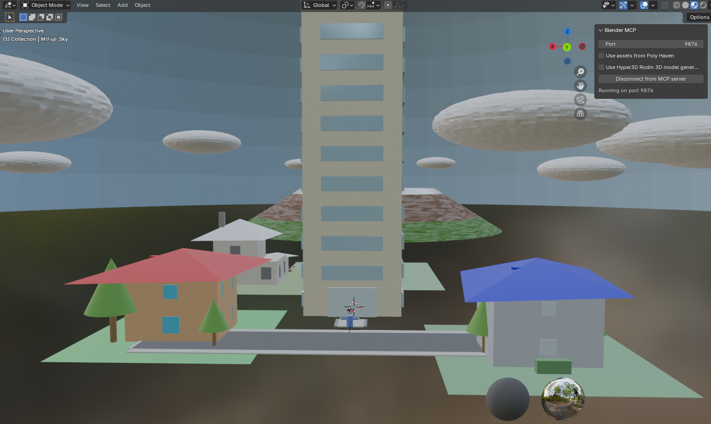
*Example of 3D models generated solely from natural language instructions.*

## Overview

This repository introduces how to set up and use Visual Studio Code (VSCode) in conjunction with the Model Context Protocol (MCP) to generate 3D models in Blender using only natural language instructions.

This guide is particularly recommended for those interested in Python and Blender workflows, or for anyone curious about what MCP can do and wants to experiment visually. You can experience everything from basic setup to creating your first 3D model in about 30 minutes.

This document will guide you step-by-step through:
*   Setting up MCP to control Blender from VSCode.
*   Examples of creating simple 3D models.
*   (Optional) Setup instructions for the Cursor editor.

This project is inspired by the [Ahuja/blender-mcp](https://github.com/ahujasid/blender-mcp) repository. However, due to the limited information available on implementations using VSCode, we have independently verified and compiled this information.

**Note:** This project focuses on using MCP. Detailed explanations of Blender's own operations are not included. By using MCP, the need to directly operate Blender itself is often minimized.

### What is MCP (Model Context Protocol)?
The Model Context Protocol (MCP) is a protocol for sending and receiving code and information between AI models and various software applications, enabling them to work together. For more details, please refer to the [official documentation](https://modelcontextprotocol.io/introduction).

## Table of Contents
- [Blender Craft: Create 3D Models using only Natural Language with VSCode and Blender MCP](#blender-craft-create-3d-models-using-only-natural-language-with-vscode-and-blender-mcp)
  - [Overview](#overview)
    - [What is MCP (Model Context Protocol)?](#what-is-mcp-model-context-protocol)
  - [Table of Contents](#table-of-contents)
  - [Demo](#demo)
  - [Prerequisites](#prerequisites)
  - [Setup](#setup)
    - [1. Blender Setup](#1-blender-setup)
      - [1.1. Download the Add-on](#11-download-the-add-on)
      - [1.2. Install and Enable the Add-on in Blender](#12-install-and-enable-the-add-on-in-blender)
      - [1.3. Verify Setup](#13-verify-setup)
    - [2. VSCode Setup](#2-vscode-setup)
      - [2.1. Setup uv (Python Package Manager)](#21-setup-uv-python-package-manager)
      - [2.2. Create and Configure VSCode Project](#22-create-and-configure-vscode-project)
    - [3. (Optional) Setup for Cursor](#3-optional-setup-for-cursor)
  - [Usage](#usage)
    - [1. Start the MCP Server](#1-start-the-mcp-server)
      - [For VSCode](#for-vscode)
      - [For Cursor](#for-cursor)
    - [2. Connect from Blender](#2-connect-from-blender)
    - [3. Create 3D Models in Blender using AI Agent Mode](#3-create-3d-models-in-blender-using-ai-agent-mode)
      - [Example GitHub Copilot Setup (VSCode)](#example-github-copilot-setup-vscode)
    - [4. Direct Python Code Execution (Optional)](#4-direct-python-code-execution-optional)
  - [Observations](#observations)
  - [References](#references)
  - [License](#license)

## Demo
Below are examples of 3D models generated in Blender via MCP using natural language instructions from VSCode (or Cursor). No direct manipulation of Blender was performed.

| Sample Creations1 | Sample Creations2 |
| :---------------------------: | :--------------------: |
|  | 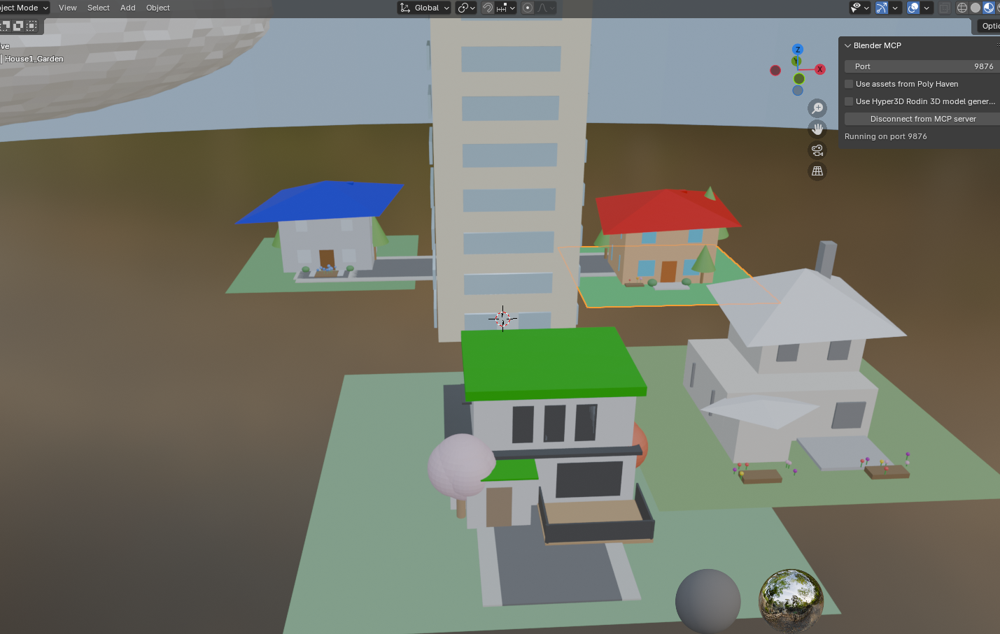 |
| 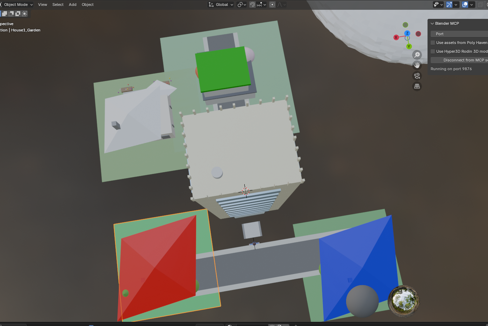 | 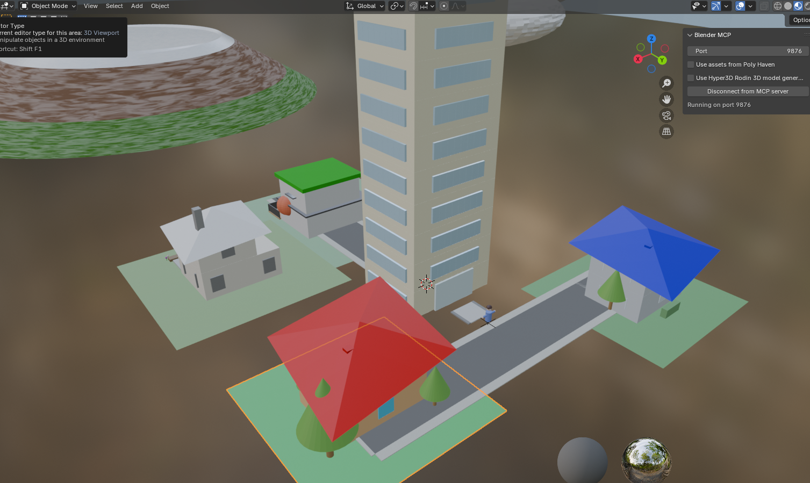 |

## Prerequisites
Please install the following software beforehand:
- [Blender](https://www.blender.org/download/)
- [Visual Studio Code](https://code.visualstudio.com/)
- (Optional) [Cursor](https://www.cursor.com/en)

## Setup

### 1. Blender Setup
#### 1.1. Download the Add-on
Download the `addon.py` file from the [Ahuja/blender-mcp repository](https://github.com/ahujasid/blender-mcp) ([direct link to addon.py](https://github.com/ahujasid/blender-mcp/blob/main/addon.py)) to your local machine.

#### 1.2. Install and Enable the Add-on in Blender
1.  Launch Blender.
2.  Go to **Edit** → **Preferences** → **Add-ons**.
    
    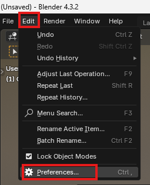

3.  Click the **Install...** button.
    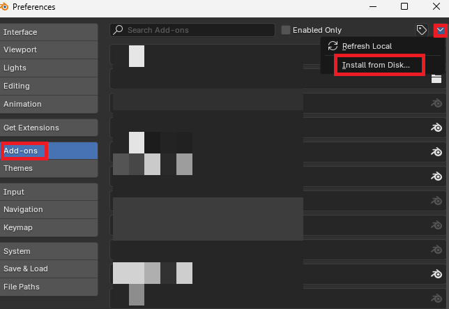

4.  Select the downloaded `addon.py` file and install it.
    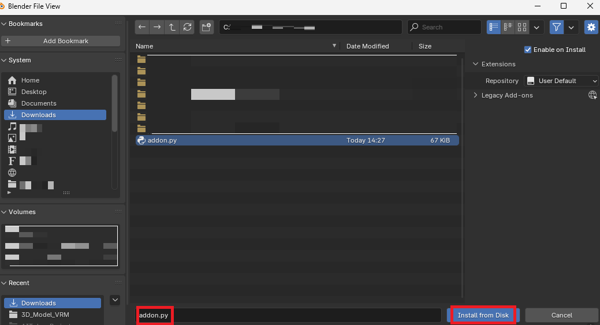
5.  After installation, search for "BlenderMCP" in the add-on list and enable it by checking the checkbox.

#### 1.3. Verify Setup
1.  In Blender's 3D Viewport, press the **N key** to display the sidebar.
2.  If a "BlenderMCP" tab appears in the sidebar, the setup was successful.
    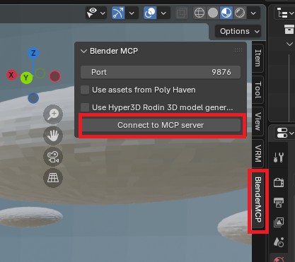

### 2. VSCode Setup
#### 2.1. Setup uv (Python Package Manager)
1.  **Install the uv package manager:**
    *   Windows (PowerShell):
        ```powershell
        powershell -ExecutionPolicy ByPass -c "irm https://astral.sh/uv/install.ps1 | iex"
        ```
    *   macOS / Linux (Terminal):
        ```bash
        curl -LsSf https://astral.sh/uv/install.sh | sh
        ```
2.  **Add uv to PATH (Example for Windows):**
    Restart your terminal or run the following command (replace `YOUR_USERNAME` with your actual username).
    ```powershell
    # To add permanently (PowerShell)
    $CurrentUserPath = [System.Environment]::GetEnvironmentVariable("Path", "User")
    $UvBinPath = "$($env:USERPROFILE)\.local\bin" # Common install location for uv
    if (-not ($CurrentUserPath -split ';' -contains $UvBinPath)) {
        [System.Environment]::SetEnvironmentVariable("Path", "$CurrentUserPath;$UvBinPath", "User")
        Write-Host "uv path added. Please restart your terminal."
    } else {
        Write-Host "uv path already exists."
    }
    ```
    *If the above command doesn't work or you want to set the PATH temporarily, you can run `set Path=C:\Users\YOUR_USERNAME\.local\bin;%Path%` in Command Prompt. This is only effective for the current session.*

3.  **Verify uv (Optional):**
    Open a new terminal and check if `uv --version` works.

    It's also a good idea to run the following, just in case:
    ```bash
    pip install uv
    ```

#### 2.2. Create and Configure VSCode Project
1.  Create a working folder in any location (e.g., `blender-craft`).
2.  Open this folder as a workspace in VSCode.
3.  Create a `.vscode` folder in the root of your workspace, and inside it, create an `mcp.json` file with the following content:

    **.vscode/mcp.json:**
    ```json
    {
        "servers": {
          "blender": {
            "command": "uvx",
            "args": ["blender-mcp"]
          }
        }
    }
    ```
    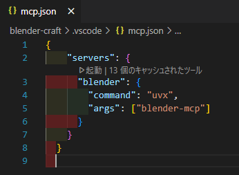

### 3. (Optional) Setup for Cursor
These are the setup instructions if you are using the Cursor editor. This section is not necessary if you are using VSCode.

1.  Create a working folder in any location (can be the same folder as for VSCode).
2.  Open this folder as a workspace in Cursor.
3.  Create a `.cursor` folder in the root of your workspace, and inside it, create an `mcp.json` file with the following content:

    **.cursor/mcp.json:**
    ```json
    {
        "mcpServers": {
            "blender": {
                "command": "cmd",
                "args": [
                    "/c",
                    "uvx",
                    "blender-mcp"
                ]
            }
        }
    }
    ```
   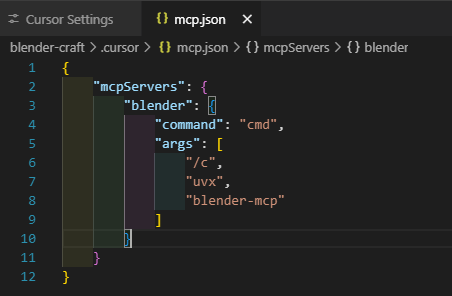

## Usage

### 1. Start the MCP Server

#### For VSCode
1.  Open the `.vscode/mcp.json` file in VSCode.
2.  Click on the "Start" text (CodeLens) that appears within the file.
    
    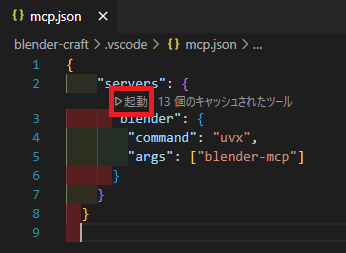

3.  Confirm that the text changes to "Running".

    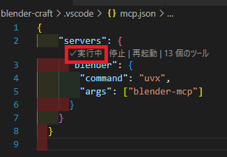

#### For Cursor
1.  Go to **File** → **Preferences** → **Settings** and open "Cursor Settings".
2.  Select **MCP** from the left-hand menu.
    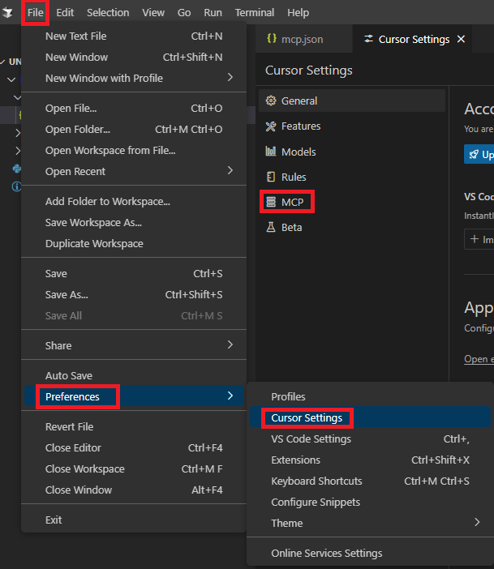
3.  The server defined in `mcp.json` ("blender") should appear in the list. Turn on the switch to its right. A status indicator (e.g., a green icon) should show it's active.
    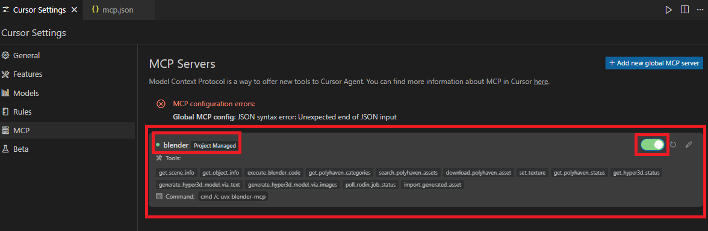

### 2. Connect from Blender
1.  In Blender's 3D Viewport, press the **N key** to display the sidebar.
2.  Click on the "BlenderMCP" tab.
3.  Click the "Connect to MCP server" button.
    
    

4.  If the button text changes to "Disconnect from MCP server", the connection is successful.
    
    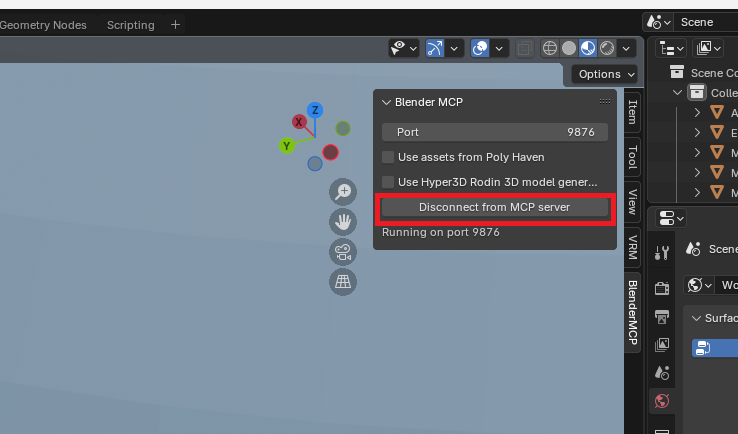

### 3. Create 3D Models in Blender using AI Agent Mode
Once VSCode (or Cursor) is successfully connected to Blender, you can use AI chat features in agent mode (e.g., GitHub Copilot Chat with `@workspace` or editor features, Cursor's AI features) to generate objects in Blender by giving natural language instructions.

#### Example GitHub Copilot Setup (VSCode)
When using GitHub Copilot Chat in VSCode, mention `@blender` (or the server name configured in `mcp.json`) in the chat window, or configure the agent so it can recognize the MCP server. (With an established MCP connection, Copilot can better understand the Blender context.)
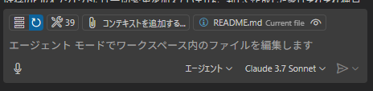

The AI will convert your instructions into Python code (Blender Python API) and send it to Blender via MCP to generate the 3D model.

### 4. Direct Python Code Execution (Optional)
You can also write and execute Python scripts directly in Blender without going through AI chat. This is useful for automating specific operations or for modifying/extending code generated by the AI.

1.  Create a new Python file in VSCode (or Cursor) (e.g., `create_cube.py`).
2.  Enter the following sample code:

    ```python
    import bpy

    # Clear existing objects (optional)
    if bpy.context.mode == 'OBJECT':
        bpy.ops.object.select_all(action='SELECT')
        bpy.ops.object.delete()
    elif bpy.context.mode == 'EDIT': # If in edit mode, switch to object mode first
        bpy.ops.object.mode_set(mode='OBJECT')
        bpy.ops.object.select_all(action='SELECT')
        bpy.ops.object.delete()

    # Create a cube
    bpy.ops.mesh.primitive_cube_add(size=2, location=(0, 0, 1))
    cube = bpy.context.active_object
    if cube: # Check if an object is active/selected
        cube.name = "MyCube"

        # Create and apply material
        mat = bpy.data.materials.new(name="BlueMaterial")
        mat.use_nodes = True
        principled_bsdf = mat.node_tree.nodes.get('Principled BSDF')
        if principled_bsdf:
            principled_bsdf.inputs['Base Color'].default_value = (0.0, 0.3, 0.8, 1.0)  # Blue color (RGBA)

        # Apply material to the object
        if not cube.data.materials:
            cube.data.materials.append(mat)
        else:
            cube.data.materials[0] = mat

    # Change viewport shading to Material Preview
    for area in bpy.context.screen.areas:
        if area.type == 'VIEW_3D':
            for space in area.spaces:
                if space.type == 'VIEW_3D':
                    space.shading.type = 'MATERIAL'
                    break
            break

    print("Blue cube created!")
    ```

3.  How to run the script:
    *   Select the entire file content and press `Shift + Enter` (or your configured execution key).
    *   Select a portion of the code and press `Shift + Enter`.
    *   Right-click in the editor and select an MCP-related execution command like "MCP: Run Selection" or "MCP: Run File" (options may vary depending on your editor and extensions).

**Important:**
Trying to run the script from a standard terminal like `python your_script.py` will result in a `ModuleNotFoundError: No module named 'bpy'`. The Blender Python API (`bpy`) is only available within the Blender environment, so always execute scripts from your editor via MCP.

## Observations
By connecting VSCode (or Cursor) to Blender via an MCP server, it was possible to generate 3D models using natural language or Python scripts, with minimal direct interaction with the Blender interface itself.

**Key Takeaways:**
*   **Specificity of Instructions:** Abstract instructions like "Make a house" tended to result in very simple structures (e.g., basic stacked planes). More specific instructions (e.g., "Create an 8m x 6m two-story house with beige walls, a reddish-brown gabled roof, a front porch, a grassy yard, a door, windows, and a chimney") significantly improved the detail and accuracy of the generated models.
*   **Complex Objects:** Generating complex shapes, such as human figures, or objects with intricate details, seems to require more sophisticated prompting techniques and instructions.
*   **As a Learning Tool:** This setup provides an excellent visual way to understand how MCP works in practice. The ability to experiment and learn new technologies hands-on was also very engaging.

This approach has potential for rapid prototyping, idea visualization, and creating simple assets.

## References
- [blender-mcp GitHub (Ahuja/blender-mcp)](https://github.com/ahujasid/blender-mcp) - The base repository for this project.
- [Blender Python API Documentation](https://docs.blender.org/api/current/index.html) - Official documentation for Blender Python scripting.
- [Model Context Protocol (MCP) Official Site](https://modelcontextprotocol.io/introduction) - The official MCP website.

## License
[MIT License](https://github.com/yf591/blender-craft/blob/main/LICENSE)